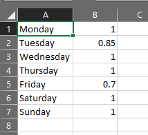
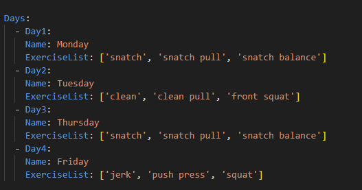
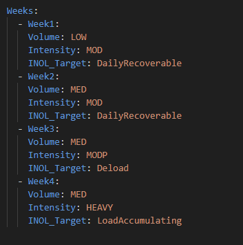

# Program Generator User Manual
## The Aim of this document
This documents aim is to show people how to use the Program generator

## Compiling and installing the workoutroutinegenerator module
1. open a terminal, and run the setup.py script with python3.10+ as follows: `python3.x setup.py sdist` (where x is your python 3 version number).
2. go to the \WorkoutRoutineGenerator\dist directory in a terminal
3.  run `python3.x -m pip install release` (substituting x with your python number and *release* with the release number you just compiled

## Configuring the Program Generator
When trying to create a new program block, first you need to configure which days of the week you would like to train on, and what exercises you would like to practice 
### Selecting workout days
To select workout days, open the Days.csv document. You will see days and floating point numbers as pictured below

The floating point numbers are the volume multipliers of the days. That means, if you set the floating point number to 1, the volume setting for that days will not be modified. If you 
set the float to 0.5, the volume will be doubled (to be exact, the INOL will be doubled, but more on that later), if set to 2.0, the INOL target will be halved. 
I strongly recommend you to leave the priority settings on 1.0 for the first few blocks, and feel it out for yourself whether you need more volume and intensity or not. 

After setting up the day priorities, copy the days you would like to work out on into the ProgramConfig.yml file as shown in the picture below. 

It is best practice to copy-paste day names from the days.csv file. The program generator does check the day names, so it will probably crash on typos with an error message, but that is not necessarily a good user experience. 

### Selecting Exercises
When selecting exercises, check out the Exercises.csv file. Similarly to the file containing the days, the exercise file contains the selectable exercises. The values it contains in order are: name(string type), minimum number of repetitions(int), maximum number of repetitions (int), priority (float, very similar to the day priority float), generatewarmup(boolean, leave emply for false). You can modify repetition preferences, priorities, warmup generation by modifying the exercise row, or add new exercises by adding a new row. The minimum and maximum number preferences are entirely up to personal preference and aim (for example, a bodybuilder will use sets containing 8-12-15 repetitions of squats, whereas a weightlifter rarely goes above 8 repetitions and below 3, while powerlifters will squat heavy singles to sets of 5 repetitions maximum to replicate competition paramteres as much as they can). There arent any constraints on exercise selection. You can do 1 exercise one day, and 8 on the other, mix and match competition and supplementary exercises. So your freedom is quite high, but the possibility of errors is as well. Be reasonable with exercise selection. 1-3 main, and 4-0 supplementary exercises on 2-4 workout days are more then plenty usually. If you are on gear or otherwise genetically enhanced (which, chances are, you are not), you can do more exercises, more volume, more priority, more workout days.

### Setting Up Weeks
Week setups can also be found under the ProgramConfig.yml file. 

there is also an explanation what options the week settings take at the top of the file. Volume settings can be LOW for low, MED for medium, and HIGH for high volume. 
Intensities range from light to maximal, and INOL targets can be deload, dailyRecoverable and LoadAccumulating. 
There are a few suggestions: high volume and high intensity does not match very well. the INOL target does rectify bad pairings (for example high volume with heavy or heavy plus intensity is a bad choice for almost anyone, but the INOL target setting does not allow the program generator to create a workout routine that runs you to the ground). With that said, INOL target values can be changed. But I highly highly recommend you only change those values on a block-by-block, day-by-day and exercise-by-exercise basis, and only change the INOL targets entirely if you see the program consistently underdeliver (which in my experience it does not [but obviously your mileage my vary]).

Other suggestions: If you are not a genetic freak or an enjoyer of performance enhancing pharmaceuticals, two load accumulating weeks back-to-back is a bad idea. Same with more than 3 daily recoverable weeks, or two dailyrecoverable followed by a load accummulating. You can do these, especially if you have your daily and exercise priority settings dialed in, but for beginners, people who do not know their limits: you should probably stick to the above guidelines. 

## Starting the Program Generation 
Generating the program is easy: just start the GenerateProgram.bat file. It requires you to have python 3.11 installed, and the modules described in the requirements.txt installed, but for python 3.11 you can visit the microsoft store, for the module installation you can follow the instructions under [this link](https://stackoverflow.com/questions/7225900/how-can-i-install-packages-using-pip-according-to-the-requirements-txt-file-from)
